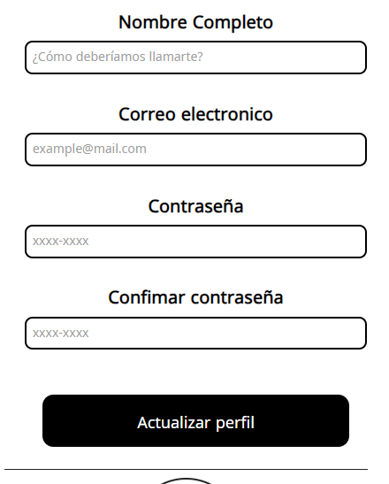

# Este es un proyecto de formulario accesible para personas con dificultades visuales.
## Usando atributos como aria-required & required Desde Html

# Vista desde pc

# Vista desde dispositivos moviles

https://roadmap.sh/projects/accessible-form-ui
